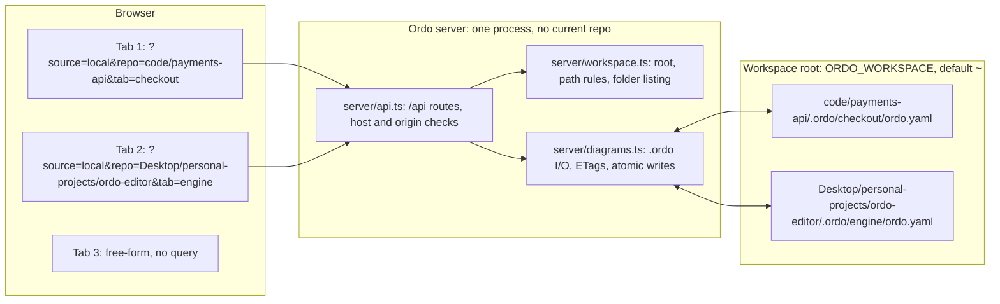
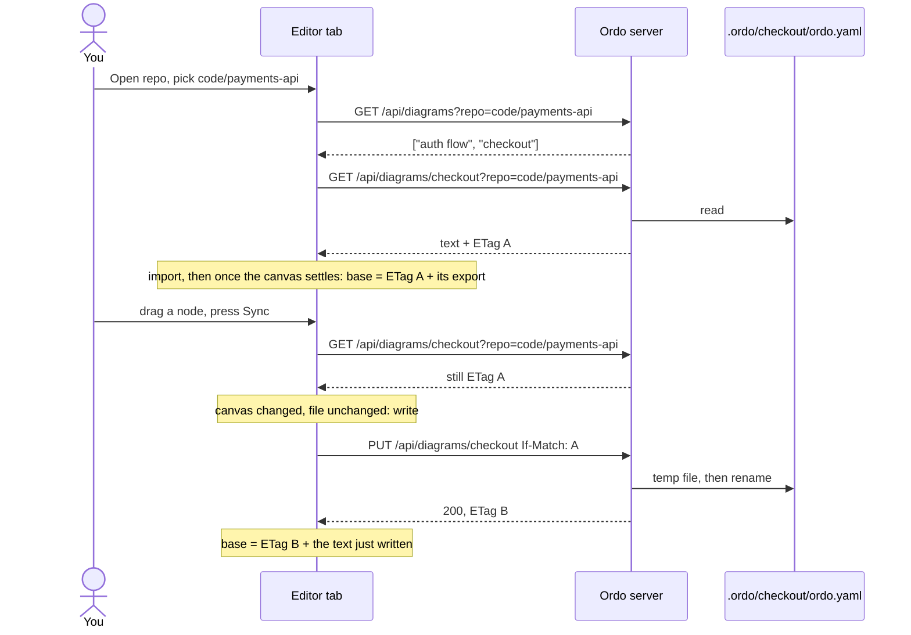
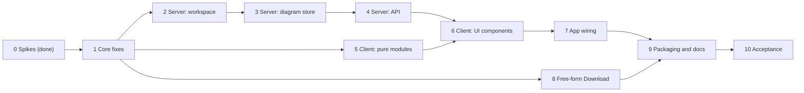

# Ordo Local Mode, Iteration 1: Implementation Plan

This plan takes Ordo from "a canvas you copy YAML out of" to "an editor that opens a repo and saves into it". It covers free-form mode's YAML download and local repo mode, and nothing else. The design comes from the spec doc linked above; this file says how to build it, in what order, and how to prove each step works.

**Baseline**, checked on a clean install of the repo on 2026-10-09 (Node 22): `npm test` passes 186 of 186 and `npm run typecheck` is clean. Every phase below ends with both still green.

## Contents

1. [What we're building](#1-what-were-building)
2. [Decisions this plan assumes](#2-decisions-this-plan-assumes)
3. [Architecture](#3-architecture)
4. [Phase 0: spikes (done)](#4-phase-0-spikes-done)
5. [Build phases](#5-build-phases)
6. [Sync in detail](#6-sync-in-detail)
7. [API reference](#7-api-reference)
8. [Security checklist](#8-security-checklist)
9. [File-by-file changes](#9-file-by-file-changes)
10. [Commit plan](#10-commit-plan)
11. [Risks](#11-risks)
12. [Acceptance](#12-acceptance)
13. [Open questions](#13-open-questions)

### Rules for whoever implements this

- Work phase by phase, in order. Phases 1 and 5 are pure code with unit tests; write the tests first.
- Don't change the YAML format. `ordo.yaml` is today's one-file format: structure, `---`, layout.
- Follow the codebase's conventions: TypeScript with `.ts` import extensions, `node:test` through `tsx`, pure logic kept out of React (as `history.ts` is), comments that say why.
- No new runtime dependencies. Everything here uses Node, Express 5, React 19, React Flow 12 and `yaml`, which are already installed.
- If a step forces a change to a decision in section 2, stop and ask.

---

## 1. What we're building

```
free-form    http://localhost:5173/                      draw, Import YAML (exists), Download YAML (new)
local mode   http://localhost:5173/?source=local&repo=code/payments-api&tab=checkout
             └─ repo picker → <repo>/.ordo/<name>/ordo.yaml per diagram → footer tabs → manual two-way Sync
```

**In:** free-form Download; repo picker over a workspace root; repo and tab in the URL; `.ordo/<name>/ordo.yaml` per diagram; footer tab bar with `+` (create only); manual two-way Sync with conflict handling; the server API and its security; running from a clone or Docker, one instance for every repo.

**Out:** SVG/PNG import or export; hosted mode and GitHub; automatic sync or file watching; renaming, deleting or reordering tabs in Ordo; any git operation; YAML format, MCP, CLI or skill changes; merging two versions; serving on a LAN.

---

## 2. Decisions this plan assumes

**Decided** by Subhadip on 2026-10-09:

| # | Decision |
|---|---|
| D1 | Two modes: free-form (draw, open and download YAML) and local repo mode |
| D2 | No SVG import or export in iteration 1 |
| D3 | Each diagram lives at `<repo>/.ordo/<name>/ordo.yaml`; folder name = tab name; Ordo creates `.ordo/` when missing |
| D4 | Diagrams are footer tabs, Lucid-style; `+` creates a diagram |
| D5 | Tab actions: create only |
| D6 | No automatic sync; a Sync button, two-way, Ordo picks the direction |
| D7 | Repo picker; the repo shows in the URL with a parameter marking local mode |
| D8 | One Ordo instance serves every repo |
| D9 | Runs from a clone or Docker, locally only; hosted/GitHub later |

**Proposed** in the spec and still marked Proposed there. This plan assumes all of them; the last column says what a "no" would change.

| # | Proposal | Touches |
|---|---|---|
| P1 | `source=local` marks local mode | Phase 5 (location) |
| P2 | `repo` is relative to the workspace root | Phases 2, 5 |
| P3 | Root = home folder (npm) or `/workspace` (Docker); `ORDO_WORKSPACE` overrides | Phases 2, 9 |
| P4 | Server keeps no "current repo"; every call names it | Phase 4 |
| P5 | Query parameters, no client router | Phase 5 |
| P6 | I/O only inside `<repo>/.ordo/`; picker returns folder names only | Phases 2, 3 |
| P7 | Hash-checked writes (`If-Match`) | Phases 3, 4, 7 |
| P8 | Tabs sorted A–Z, no order file | Phase 3 |
| P9 | New names: ASCII letters, digits, space, `-`, `_`, `.`; unique ignoring case | Phases 3, 6 |
| P10 | `.ordo/` created with the first diagram, not on open | Phase 3 |
| P11 | One live canvas; leaving a tab with unsynced edits asks first | Phase 7 |
| P12 | Server validates YAML before writing (422) | Phase 3 |
| P13 | `.yaml` everywhere | Phase 1 |
| P14 | Ordo never runs git | (nothing to build) |
| P15 | Loopback-only binding, Docker included | Phase 9 |
| P16 | Mermaid import keeps the file's baseline in local mode | Phase 7 |

---

## 3. Architecture



- **The server is stateless.** Every request carries `repo` (and `tab`). Nothing about a browser tab lives on the server, so two tabs can't move each other.
- **The client owns the sync state.** Each open diagram keeps a base: the file's ETag when last loaded or written, and the canvas export at that moment. Sync compares both against it (section 6).
- **One writer for both modes.** Local mode saves exactly what View Ordo YAML shows today: `exportOrdo(nodes, edges, session).text`.

One diagram's life, end to end:



---

## 4. Phase 0: spikes (done)

Run on 2026-10-09 against a clean install of the repo, with scripts that call the real `importOrdo`, `exportOrdo`, `readDiagram`, Express and React Flow. An independent review of this plan against the code added the last three rows. These results shape the phases below.

| Question | Result | What the plan does about it |
|---|---|---|
| What does a new, empty diagram contain? | `exportOrdo([], [], null).text` is `ordo: 1\nnodes: []\n---\nordo-layout: 1\n`, and `readDiagram` accepts it | `POST` writes exactly this (Phase 3) |
| Does an untouched canonical file export byte for byte? | Yes: the checkout fixture bundle, a double-quoted label and an end-of-line comment all come back identical | Nothing |
| A file with no layout document? | Its first export adds the layout document | Compare the canvas with its own export after load, not with the disk text, so opening never marks a diagram unsynced (section 6) |
| Other whitespace styles? | First write rewrites them: 4-space indent changes 42 of 58 lines, unindented sequences 12 of 58, both 30 of 58. CRLF becomes LF on every line. A missing final newline is added, runs of blank lines collapse, trailing spaces go. One write is a fixed point. | Phase 1.1 keeps the indent style; the server keeps CRLF; the rest is accepted |
| Can `yaml` reproduce 4-space or unindented sequences? | Only for files laid out the way `yaml` writes them: `toString({ indent: 4 })` and `toString({ indentSeq: false })` round-trip those exactly. A hand-written 4-space file whose group children sit 4 spaces past the dash still has those lines rewritten (`        - gateway` becomes `          - gateway`) | Phase 1.1 keeps top-level and mapping indentation; children nested under a list item follow `yaml`'s layout |
| How does Express 5 hand over path and query values? | `%2F` is decoded, so `/api/diagrams/..%2F..` arrives as `tab = "../.."`. A repeated `repo=` arrives as an array | `tab` is matched against directory entries, never joined into a path; non-string query values get 400 |
| Can `node_modules` move between machines? | No: the Mac's `node_modules` fails on Linux (esbuild and the TypeScript 7 binary are per-platform) | `.dockerignore` excludes `node_modules`; the image runs `npm ci` |
| Do `exportOrdo` and `readDiagram` run in plain Node? | Yes, under `tsx`, as `server/mcp.ts` already does | The server reuses them for validation and new files |
| Does `useNodesInitialized()` reset as soon as the canvas is swapped? | No: for one commit after a swap it still reports the previous diagram's `true`, because React Flow copies nodes into its store in an effect | Phase 7 waits for `false`, then `true` |
| What does git do to a diagram's folder when its file goes? | `git rm`, or checking out a branch without the file, removes the emptied folder too | A recreate creates the folder again (Phase 3) |
| Can a test send a custom `Host` header with `fetch`? | No: Node's `fetch` sends the real host | The Host test uses `http.request` (Phase 4) |

---

## 5. Build phases



Phases 2–4 (server) and 5 (client logic) can run in parallel once Phase 1 is in.

### Phase 1: core fixes

Small changes to existing code that the later phases depend on. No new feature is visible yet.

**1.1 The writer keeps a file's indentation** (recommended; Phase 0 shows why)

- `src/ordo/read.ts`: add `detectStyle(text: string): YamlStyle`, where `type YamlStyle = { indent: number; indentSeq: boolean }`.
  - `indent`: the leading-space count of the first nested mapping key (for example `  nodes:` under `data:`). Default 2.
  - `indentSeq`: decided only from the first block-sequence item (a line that is `- …` after optional spaces) directly under a key with no inline value, such as `nodes:` with its list below it. Indented means `true`, column 0 means `false`. A file with no such item, including a new diagram's `nodes: []`, defaults to `true`; reading the `---` after `nodes: []` as a list item would wrongly give `false`.
- `src/ordo/index.ts`: `OrdoSession` gains `style?: YamlStyle`. `importOrdo` returns `style: detectStyle(text)`. `exportOrdo` passes `session?.style` to the writer.
- `src/ordo/write.ts`: `writeOrdo` and `writeLayout` take an optional style and call `doc.toString({ ...STRINGIFY, ...style })`.
- `src/components/OrdoImportDialog.tsx` and `App.tsx`: carry `style` from the import result into the session.
- **Limit:** `yaml` lays out children nested under a list item its own way, so a hand-written group like `    - vpc:` / `        - gateway` still moves on the first write. Top-level and mapping indentation are kept.
- **Tests** in `src/ordo/__tests__/ordo.test.ts`:
  - The checkout bundle restyled by `yaml` with `indent: 4`, with `indentSeq: false`, and with both, each imports and exports byte for byte.
  - A hand-written 4-space file keeps every line except the group children nested under a list item; assert exactly which lines move.
  - A drag in the 4-space file changes only lines after the `---`.
  - `detectStyle` on `EMPTY_DIAGRAM` gives `{ indent: 2, indentSeq: true }`.

**1.2 `.yaml` everywhere (P13)**

- `src/ordo/index.ts`: `fileName = (name) => \`${name}.yaml\``.
- `src/components/OrdoImportDialog.tsx` and `ViewYamlDialog.tsx`: user-facing `.yml` wording becomes `.yaml`. `ACCEPT` stays `.yml,.yaml`.
- Update any test that asserts an exported `.yml` name.

**1.3 Undo history can start over**

Undo diffs are applied to the live lists. After a tab switch, undoing a step recorded on another diagram would put that diagram's nodes into this one, and the next Sync would write them to the wrong file.

- `src/history.ts`: `createUndoStack` gains `clear()`, which empties both stacks.
- `src/useHistory.ts`: `useHistory({ nodes, edges, setNodes, setEdges, epoch })`. An effect on `epoch` calls `stack.clear()` and sets `baseline.current = live.current`. It runs after the commit, so the baseline is the new graph.
- **Test** in `src/__tests__/useHistory.test.ts`: after an `epoch` change, undo changes nothing.

**Done when** `npm test` and `npm run typecheck` pass, including the new tests.

### Phase 2: server, workspace root and path rules

New file `server/workspace.ts`. Tests in `server/__tests__/workspace.test.ts`, run against a temporary directory as the root.

```ts
export type Workspace = { root: string; label: string };
export type Folder = { name: string; git: boolean; ordo: boolean };

// Fields declared, not constructor parameter properties: tsconfig sets erasableSyntaxOnly.
export class HttpError extends Error {
  status: number;
  body?: object;
  constructor(status: number, message: string, body?: object) {
    super(message);
    this.status = status;
    this.body = body;
  }
}

/** Root = realpath(ORDO_WORKSPACE ?? os.homedir()); exits the process with a clear message if it is not a directory. */
export async function openWorkspace(env?: NodeJS.ProcessEnv): Promise<Workspace>;

/** Syntax only: "" or "." → []; otherwise `/`-separated segments. Throws HttpError(400). */
export function parseRel(rel: unknown): string[];

/** Joins under the root, takes the real path, and requires it inside the root and a directory. 403 outside, 404 missing. */
export async function resolveInRoot(ws: Workspace, segments: string[]): Promise<string>;

/** Subfolders only: dot-folders hidden, A–Z (numeric, case-insensitive), at most 1,000. */
export async function listFolders(ws: Workspace, rel: string): Promise<{ path: string; folders: Folder[]; truncated: boolean }>;
```

- **`label`** is `~` when the root is the home folder, otherwise the root's base name. The absolute path never leaves the server.
- **`parseRel` rejects** a non-string (an array from a repeated parameter), more than 1,024 characters, a NUL byte, a backslash, a leading `/`, a drive letter (`C:`), and any empty, `.` or `..` segment.
- **Containment:** `real === ws.root || real.startsWith(ws.root + path.sep)`, with the root itself also real-pathed at startup.
- **`listFolders`:** `readdir(withFileTypes)`. A symlinked folder is listed only if its real path is inside the root. `git` is true when `.git` exists in any form (worktrees use a file); `ordo` is true when `.ordo` is a real directory. Folders that can't be read (`EACCES`, or `EPERM` from macOS privacy controls) are skipped.
- **Collation everywhere:** `new Intl.Collator("en", { numeric: true, sensitivity: "base" })`.

**Tests:** each `parseRel` rejection; `..` reached through a symlink gives 403; a symlinked folder pointing outside the root is not listed; dot-folders hidden; `git`/`ordo` flags; truncation at 1,000; `label` is `~` for a home root.

**`package.json`, in this phase:** the test script also runs `"server/**/__tests__/*.test.ts"`. Today's glob covers only `src/`, so without this the server tests in Phases 2–4 would silently never run.

### Phase 3: server, diagram store

New files `src/local/names.ts` (shared with the client) and `server/diagrams.ts`. Tests in `src/local/__tests__/names.test.ts` and `server/__tests__/diagrams.test.ts`.

```ts
// src/local/names.ts
/** null when `name` may be created; otherwise why not, as a reason the server maps to 400 or 409 and one sentence for the UI. */
export function checkDiagramName(
  name: string,
  existing: readonly string[],
): { reason: "invalid" | "taken"; message: string } | null;
```

Rules: `/^[A-Za-z0-9][A-Za-z0-9 _.-]{0,63}$/`; no trailing space or dot; not `/^(con|prn|aux|nul|com[1-9]|lpt[1-9])(\..*)?$/i`; not equal, ignoring case, to any name in `existing` (the existing diagrams).

```ts
/** A name that is safe as one folder name, for recreating a diagram whose folder is gone: non-empty, at most 255 bytes, not "." or "..", no "/", "\" or NUL. */
export function isSafeSegment(name: string): boolean;
```

```ts
// server/diagrams.ts
export const ORDO_DIR = ".ordo";
export const DIAGRAM_FILE = "ordo.yaml";
export const EMPTY_DIAGRAM = exportOrdo([], [], null).text!; // "ordo: 1\nnodes: []\n---\nordo-layout: 1\n"

export type Precondition = { ifMatch: string } | { ifNoneMatch: "*" };

export async function listDiagrams(repoDir: string): Promise<string[]>;
export async function readDiagramFile(repoDir: string, tab: string): Promise<{ text: string; etag: string }>;
export async function createDiagram(repoDir: string, name: string): Promise<{ text: string; etag: string }>;
export async function writeDiagramFile(repoDir: string, tab: string, text: string, pre: Precondition): Promise<{ etag: string }>;
```

- **`listDiagrams`:** no `.ordo` means an empty list; a symlinked `.ordo` is 403. Lists real (non-symlink) directories that hold a regular file `ordo.yaml`, sorted A–Z.
- **Resolving `tab`** for reads and for writes with `If-Match`: `tab` must be a string exactly equal to an entry name read from `.ordo/`. It is never joined from the URL, which is what makes `tab = "../.."` harmless. A missing entry gives 404 on a read and 412 on an `If-Match` write. The folder and `ordo.yaml` must not be symlinks (`lstat`).
- **Resolving `tab` for a recreate** (`If-None-Match: *`): git removes a folder together with its last file, so the folder may be gone. `tab` must pass `isSafeSegment` (else 400); then `.ordo` and the folder are created as needed, refusing symlinks.
- **ETag:** `"<sha256 hex of the file's bytes>"`, quoted.
- **`createDiagram`:** `checkDiagramName(name, await listDiagrams(repoDir))`; reason `invalid` gives 400 and `taken` gives 409. A directory entry spelled exactly `name` but holding no `ordo.yaml` is reused; one that differs only in case gives 409, because it is the same folder on macOS and Windows. Then `mkdir` `.ordo` and `.ordo/<name>`, and write `EMPTY_DIAGRAM` with flag `wx`; `EEXIST` gives 409.
- **`writeDiagramFile`**, inside a per-file lock (`Map<string, Promise>` chain) so the check and the rename can't interleave:
  1. Read the current bytes; a missing folder or file counts as no file.
  2. Check the precondition: `ifMatch` needs a file with that ETag; `ifNoneMatch: "*"` needs no file. Otherwise 412.
  3. Validate with `readDiagram(text)`. Any error gives 422 with `{ error, diagnostics }`.
  4. If the current file used CRLF, convert the text's `\n` to `\r\n`.
  5. Write `.ordo.yaml.<uuid>.tmp` in the same folder with flag `wx`, then `rename` it over `ordo.yaml`. On failure, remove the temp file; the old file is untouched.
  6. Return the ETag of the bytes written.

**Tests:** name rules (each rule, case-insensitive clash, Windows device names with an extension); list order and filtering; create gives `EMPTY_DIAGRAM` and creates `.ordo/`; create over an existing diagram gives 409; create reuses an exact-name folder without `ordo.yaml` and refuses a case variant; 412 for a stale `If-Match` and for `If-Match` on a deleted file; 412 for `If-None-Match: *` over an existing file; a recreate after the folder was deleted succeeds; 422 for invalid YAML; CRLF kept; a failed rename leaves the old file intact; symlinked `.ordo`, tab folder or file gives 403.

### Phase 4: server, HTTP API

`server/api.ts` becomes a factory; `server/index.ts` opens the workspace at startup.

```ts
// server/api.ts
export function createApi(ws: Workspace): express.Router;

// server/index.ts
const ws = await openWorkspace();
app.use("/api", createApi(ws));
console.log(`ordo workspace root: ${ws.root}`);
```

- **Remove** the router-level `api.use(express.json())` in today's `server/api.ts`. It runs before every route and its 100 kB default would override the per-route limits below.
- **Middleware**, in order, on the whole `/api` router:
  1. A host check with the same allowed names as `localhostHostValidation()` (`localhost`, `127.0.0.1`, `[::1]`, any port). Write it as a few lines of our own, because the package's middleware answers 403 with a JSON-RPC body rather than `{ error }`.
  2. An exact-origin check: pass when there is no `Origin`; otherwise require `Origin === "http://" + req.headers.host`, else 403. The package's `localhostOriginValidation()` ignores the port, so it isn't enough on its own.
- **Body parsers per route:** `POST` uses `express.json({ limit: "16kb" })`; `PUT` uses `express.text({ type: "application/yaml", limit: "5mb" })`. Check `req.is(...)` first: the wrong type gives 415.
- **An error handler last on the router** turns every error into JSON: a `HttpError` becomes `res.status(e.status).json({ error: e.message, ...e.body })`; body-parser errors keep their status (413 for `entity.too.large`, 400 for `entity.parse.failed`) with `{ error }`; anything else is a 500 with a generic message. Without it, an oversized body gets Express's HTML 413 page.
- **Routes** are listed in section 7. `/api/health` and the 404 fallback stay.
- **Every response** carries `Cache-Control: no-store`.

**Tests** in `server/__tests__/api.test.ts`: mount `createApi(ws)` on an Express app, `listen(0, "127.0.0.1")`, and call it with `fetch`.

- Traversal: `repo=../x`, `repo=/etc`, `repo=a\b`, `repo=C:/x`, and a repeated `repo` all give 400; a symlink out of the root gives 403.
- `tab=..%2F..` gives 404, with nothing read.
- `Origin: http://evil.example` gives 403, and so does `Origin: http://localhost:3000` on another port.
- `Host: evil.example` gives 403. Send this one with `http.request`: Node's `fetch` drops a custom `Host` header and sends the real one.
- `PUT` without a precondition gives 428; stale gives 412; invalid gives 422 with diagnostics; `text/plain` gives 415; 6 MB gives 413 as JSON; a 50 kB `POST` gives 413.
- Create, read, write and read again: the ETags change and the bytes match.

### Phase 5: client, pure modules

New folder `src/local/`, with tests in `src/local/__tests__/`. No React in this phase.

```ts
// src/local/location.ts
export type Place = { source: "free" } | { source: "local"; repo: string; tab: string | null };
export function readPlace(search: string): Place;   // anything but source=local reads as free-form
export function placeUrl(place: Place): string;     // "/" or "/?source=local&repo=code/payments-api&tab=auth%20flow"
```

`placeUrl` encodes each value with `encodeURIComponent`, then puts `/` back in `repo` so the path stays readable. `readPlace` uses `URLSearchParams`.

```ts
// src/local/api.ts: thin fetch wrappers; non-2xx responses throw ApiError { status, body }
export const getWorkspace: () => Promise<{ label: string }>;
export const listFolders: (path: string) => Promise<{ path: string; folders: Folder[]; truncated: boolean }>;
export const listDiagrams: (repo: string) => Promise<{ diagrams: string[] }>;
export const createDiagram: (repo: string, name: string) => Promise<{ text: string; etag: string }>;
export const readDiagramFile: (repo: string, tab: string) => Promise<{ text: string; etag: string } | null>; // null on 404
export const writeDiagramFile: (repo: string, tab: string, text: string, pre: Precondition) =>
  Promise<{ ok: true; etag: string } | { ok: false; status: 412 } | { ok: false; status: 422; diagnostics: Diagnostic[] }>;
```

```ts
// src/local/sync.ts: the decision table of section 6 as a pure function
export type CanvasState = "unchanged" | "changed" | "unexportable";
export type FileState = "same" | "changed" | "changed-invalid" | "deleted";
export type SyncAction =
  | "nothing" | "write" | "load" | "show-invalid" | "close"
  | "conflict" | "conflict-invalid" | "deleted" | "blocked" | "blocked-take";
export function decideSync(canvas: CanvasState, file: FileState): SyncAction;

/** "unexportable" when the export is refused; otherwise compared with the base export. */
export function canvasState(exported: string | null, baseExported: string): CanvasState;
```

```ts
// src/local/recent.ts: per-browser conveniences; every read and write inside try/catch
export function recentRepos(): string[];            // newest first, at most 8
export function rememberRepo(repo: string): void;
export function lastPickerPath(): string;
export function rememberPickerPath(path: string): void;
```

**Tests:** all 12 `decideSync` combinations against the table in section 6; `placeUrl`/`readPlace` round trips with spaces, slashes, `%`, `#` and non-ASCII; `recent.ts` survives a throwing `localStorage`.

### Phase 6: client, UI components

First, a small helper that several pieces need: `src/local/download.ts` exports `download(text, fileName)`, which saves text through a `Blob` and a temporary `<a download>`. `SyncDialog`'s "Download mine", the leave-free-form guard and Phase 8 all use it.

New components on the existing `DialogFrame`, styled like today's dialogs. Diagnostics reuse `locationOf`, `groupDiagnostics` and `tally` from `src/components/diagnostics.ts`. Tests go in `src/__tests__/local-ui.test.ts`, driven with JSDOM and `act` like `ordo-dialogs.test.ts`, with `fetch` stubbed.

| Component | Props (sketch) | Behaviour |
|---|---|---|
| `RepoPickerDialog.tsx` | `open`, `onClose`, `onOpen(repo)` | Breadcrumb from the root's label; folder rows with `git`/`ordo` badges; click goes in; Open picks the row; "Open this folder" picks the current path; recent repos on top; shows a truncation note and readable 403/404 messages |
| `TabBar.tsx` | `tabs`, `active`, `unsynced`, `onSelect(name)`, `onCreate(name) → Promise<string \| null>` | Footer tabs A–Z; active highlight; unsynced dot; `+` opens an inline field validated by `checkDiagramName`; the server's 400/409 message shows under it |
| `SyncDialog.tsx` | `kind`, `diagnostics?`, `onChoice(choice)` | One component for every question: conflict, conflict on an invalid file, deleted file, blocked export, leaving a tab with unsynced edits (Sync and switch / Discard and switch / Cancel), leaving free-form (Download / Discard / Cancel) |
| `LocalPanel.tsx` | `kind: "empty" \| "invalid" \| "error"`, `message?`, `diagnostics?` | Over the canvas: an empty repo offers `+ New diagram`; a file that doesn't parse shows its diagnostics with line and column, and Sync retries once it's fixed; an error offers Open another repo and Free-form |
| `Toolbar.tsx` (changed) | `onOpenRepo`, `local?: { crumb: string[]; status: "loading" \| "up-to-date" \| "unsynced" \| "syncing"; onSync }` | Adds Open repo; in local mode also the breadcrumb, the status words and Sync |

**Tests:** the picker navigates, opens and shows recent repos; `+` rejects `con`, `Auth` when `auth` exists, and a trailing dot; each `SyncDialog` kind shows exactly its choices.

### Phase 7: App wiring

New hook `src/local/useLocalMode.ts` holds local mode, so `App.tsx` changes stay small.

```ts
type Base = { etag: string; exported: string | null }; // exported is null until the canvas settles

type LocalState =
  | { mode: "free" }
  | { mode: "local"; repo: string; tabs: string[]; tab: string | null;
      status: "loading" | "ready" | "empty" | "invalid" | "error";
      base: Base | null; diagnostics?: Diagnostic[]; error?: string };

export function useLocalMode(deps: {
  getGraph: () => { nodes: OrdoNode[]; edges: OrdoEdge[] };
  replaceCanvas: (nodes: OrdoNode[], edges: OrdoEdge[]) => void; // set both lists, then fit the view once measured
  session: OrdoSession;
  setSession: (s: OrdoSession) => void;
  startNewHistory: () => void;                                    // bumps useHistory's epoch
  download: (text: string, fileName: string) => void;
}): {
  state: LocalState;
  unsynced: boolean;
  openRepo(repo: string): Promise<void>;
  selectTab(name: string): Promise<void>;
  createTab(name: string): Promise<string | null>;
  sync(): Promise<void>;
  goFree(): Promise<void>;
};
```

**Flows**

- **Start-up:** `readPlace(location.search)`. For local mode, call `openRepo(repo)` with the URL's `tab`.
- **openRepo:** `listDiagrams`. If there are none, the status is `empty`. Otherwise use the URL's tab if it exists, else the first tab, and replace the URL to match. `rememberRepo`.
- **Loading a tab:**
  1. `readDiagramFile` → `importOrdo(text)`. If that fails, the status is `invalid` with its diagnostics.
  2. `replaceCanvas`, `setSession({ name: tab, ordo, layout, style })`, `startNewHistory()` (on tab or repo switch only; a load from Sync stays one undo step).
  3. `base = { etag, exported: null }`.
- **Settling the base:** React Flow copies the new nodes into its store in an effect, so right after a swap `useNodesInitialized()` still reports the previous diagram's `true` for one commit. Wait for it to go `false` and then `true` after the load, the way the existing `fitPending` effect does, then one `requestAnimationFrame` so `TubeFollower` and measurement writes land first. An empty diagram settles at once. Then `base.exported = exportOrdo(getGraph(), session).text`. Sync stays disabled until then.
- **The unsynced dot:** 300 ms after the graph stops changing, `canvasState(export, base.exported) !== "unchanged"`. Sync and `beforeunload` compute it synchronously instead.
- **sync():** `readDiagramFile` gives the file state (ETag compare, plus `readDiagram` on changed text for validity) → `decideSync` → act as section 6 says. A 412 re-runs the decision once. After a write: `base = { etag, exported: text }` and the session takes the written documents.
- **createTab:** `createDiagram` → add the tab → load it (empty canvas) → replace the URL's `tab`.
- **Guards:** switching tabs, opening another repo, going back to free-form, and Back/Forward all check unsynced edits first. For `popstate` the URL has already changed, so a Cancel pushes the previous URL back. `beforeunload` warns while unsynced.

**Changes inside `App.tsx`**

- `useHistory({ ..., epoch })`, with `startNewHistory` bumping the epoch.
- `onMermaidText`: clear the session's documents only in free-form mode (P16). In local mode the session is the file's baseline.
- ⌘S / Ctrl+S calls `sync()` in local mode. Handle `s` before the chord handler's `isTyping` early return, so ⌘S pressed in a label or the tab-name field still syncs. `preventDefault` always, so the browser's Save dialog never opens.
- Render `TabBar` under the canvas row, `LocalPanel` over the canvas, the picker and `SyncDialog`, and pass the `local` props to `Toolbar`.
- Leaving free-form with nodes on the canvas asks Download / Discard / Cancel first.

**Tests:** the hook's flows with stubbed API calls.

- A freshly loaded diagram isn't unsynced, including one with tubes riding edges. No Ordo-YAML sequence fixture exists yet: import a Mermaid sequence fixture once, export it, and commit the result under `src/ordo/__tests__/fixtures/`.
- JSDOM never measures nodes, so stub measurement (or drive the settle step directly) in these tests.
- Writes send the base ETag. A 412 lands on `conflict`. After a tab switch, undo does nothing.

### Phase 8: free-form Download

- `ViewYamlDialog.tsx`: a Download button beside Copy. It calls `download(result.text, fileName(session.name))` from Phase 6. No server call.
- **Test:** clicking Download creates a link whose name ends in `.yaml` (stub `URL.createObjectURL`).

### Phase 9: packaging and docs

**`Dockerfile`**

```dockerfile
FROM node:22-slim
WORKDIR /app
COPY package.json package-lock.json ./
RUN npm ci
COPY . .
RUN npm run build
ENV NODE_ENV=production HOST=0.0.0.0 PORT=5173 ORDO_WORKSPACE=/workspace
RUN mkdir -p /workspace
EXPOSE 5173
CMD ["npm", "start"]
```

`npm start` runs the server through `tsx`, a devDependency, so the image keeps devDependencies (plain `npm ci`, not `--omit=dev`).

**`.dockerignore`:** `node_modules`, `dist`, `.git`, `.claude`, `*.log`. Leaving out `node_modules` is required: a Mac-installed copy fails on Linux (Phase 0).

**Run:**

```bash
docker build -t ordo .
docker run --rm -p 127.0.0.1:5173:5173 \
  -v ~/code:/workspace/code \
  -v ~/Desktop/personal-projects:/workspace/personal-projects \
  ordo
```

On Linux, add `--user "$(id -u):$(id -g)"`.

**README**

- Replace "Saving does not exist yet…" and the stale Roadmap with the two modes.
- Add a Running section: npm (`npm run build && npm start`, `ORDO_WORKSPACE`) and Docker (the command above, with why `127.0.0.1:` matters).
- Point to this file.

### Phase 10: acceptance

Run the checklist in section 12 on a real repo, on macOS, with npm and then Docker. Record the results in this file's front matter (`review_status`).

---

## 6. Sync in detail

**Base:** for the open diagram, `{ etag, exported }`. Set after a load (once settled) and after every write.

- **Canvas state:** `exportOrdo(...)` refused gives `unexportable`; text equal to `base.exported` gives `unchanged`; anything else gives `changed`. Comparing with the export rather than the disk text means opening a diagram never marks it unsynced, whatever its whitespace or a missing layout document (Phase 0).
- **File state:** a fresh `GET`. 404 gives `deleted`; the same ETag gives `same`; a different ETag gives `changed`, or `changed-invalid` when `readDiagram` reports errors.

| Canvas | File | `decideSync` | What happens |
|---|---|---|---|
| unchanged | same | `nothing` | Toast "Up to date" |
| changed | same | `write` | `PUT` with `If-Match: <base etag>` |
| unchanged | changed | `load` | Import the file; one undo step |
| changed | changed | `conflict` | Keep mine (`PUT`, `If-Match: <fresh etag>`) · Take the file's · Download mine · Cancel |
| unchanged | changed-invalid | `show-invalid` | Diagnostics with line and column; nothing loads |
| changed | changed-invalid | `conflict-invalid` | Keep mine (overwrite the broken file) · Download mine · Cancel |
| unchanged | deleted | `close` | Tab removed, with a notice |
| changed | deleted | `deleted` | Recreate from canvas (`PUT`, `If-None-Match: *`) · Close tab |
| unexportable | same | `blocked` | Export diagnostics; nothing to write |
| unexportable | changed | `blocked-take` | Export diagnostics, plus Take the file's |
| unexportable | changed-invalid | `blocked` | Both sets of diagnostics |
| unexportable | deleted | `blocked` | Export diagnostics, plus a notice that the file is gone |

- A 412 on any write re-runs the decision once; a second 412 shows the conflict dialog.
- Two browser tabs on one diagram behave like you and an agent: the second Sync sees the first one's write.
- There is no merge. The base export is kept, so a three-way merge can be added later.
- Sync also refreshes the tab list (`GET /api/diagrams`).

---

## 7. API reference

| Method | Route | Request | Success | Errors |
|---|---|---|---|---|
| GET | `/api/workspace` | — | `{ label }` | — |
| GET | `/api/folders?path=` | `path` relative; empty = root | `{ path, folders: [{ name, git, ordo }], truncated }` | 400 · 403 · 404 |
| GET | `/api/diagrams?repo=` | — | `{ diagrams: string[] }` A–Z | 400 · 403 · 404 |
| POST | `/api/diagrams?repo=` | `application/json` `{ "name": "billing" }` | 201 `{ text, etag }` + `ETag` | 400 name · 409 taken · 415 |
| GET | `/api/diagrams/:tab?repo=` | — | `application/yaml` body + `ETag` | 404 |
| PUT | `/api/diagrams/:tab?repo=` | `application/yaml` body + `If-Match` or `If-None-Match: *` | 200 `{ etag }` + `ETag` | 400 unsafe name on a recreate · 412 changed or gone · 413 · 415 · 422 `{ diagnostics }` · 428 |

Every response: `Cache-Control: no-store`. Every error: `{ "error": "<one sentence>" }`, plus `diagnostics` on 422.

---

## 8. Security checklist

Each rule maps to at least one test.

| # | Rule | Where | Test |
|---|---|---|---|
| 1 | `repo`/`path` syntax: relative, `/`-separated; no `..`, `.`, empty segment, backslash, NUL, drive letter or leading `/`; strings only | `parseRel` | Phase 2, Phase 4 |
| 2 | Real path inside the root, symlinks included | `resolveInRoot` | Phase 2 |
| 3 | `tab` must equal a directory entry of `.ordo/`, never a joined path; a recreate (`If-None-Match: *`) instead requires `isSafeSegment` | `diagrams.ts` | Phase 3, Phase 4 (`..%2F..`) |
| 4 | `.ordo`, its tab folder and `ordo.yaml` are never symlinks | `diagrams.ts` | Phase 3 |
| 5 | Reads and writes only `.ordo/<tab>/ordo.yaml` and its temp file; listings return names and two flags | `workspace.ts`, `diagrams.ts` | Phases 2, 3 |
| 6 | Host header must be `localhost`, `127.0.0.1` or `[::1]` | `createApi` | Phase 4 (sent with `http.request`) |
| 7 | Origin absent, or exactly `http://<Host>` | `createApi` | Phase 4 (another port gets 403) |
| 8 | Writes accept only `application/json` or `application/yaml`, so other origins need a preflight, which fails without CORS headers | `createApi` | Phase 4 (415) |
| 9 | Binds `localhost` (npm default); Docker publishes `127.0.0.1:5173` only | `server/index.ts`, README | Acceptance |
| 10 | No auth exists, so nothing serves beyond loopback | README | — |

---

## 9. File-by-file changes

| File | New or changed | What | Phase |
|---|---|---|---|
| `src/ordo/read.ts` | changed | `detectStyle()` | 1 |
| `src/ordo/write.ts` | changed | Writers take a style | 1 |
| `src/ordo/index.ts` | changed | `OrdoSession.style`; `importOrdo` returns it; `fileName` → `.yaml` | 1 |
| `src/history.ts` | changed | `clear()` | 1 |
| `src/useHistory.ts` | changed | `epoch` | 1 |
| `src/components/OrdoImportDialog.tsx` | changed | `.yaml` wording; `style` in the result | 1 |
| `server/workspace.ts` | new | Root, path rules, folder listing | 2 |
| `package.json` | changed | Test glob includes `server/` | 2 |
| `src/local/names.ts` | new | `checkDiagramName`, `isSafeSegment` | 3 |
| `server/diagrams.ts` | new | `.ordo` store | 3 |
| `server/api.ts` | changed | `createApi(ws)`, routes, checks, JSON error handler; router-level `express.json()` removed | 4 |
| `server/index.ts` | changed | Open the workspace at startup | 4 |
| `src/local/location.ts`, `api.ts`, `sync.ts`, `recent.ts` | new | Pure client modules | 5 |
| `src/local/download.ts` | new | `download(text, fileName)` | 6 |
| `src/components/RepoPickerDialog.tsx`, `TabBar.tsx`, `SyncDialog.tsx`, `LocalPanel.tsx` | new | UI | 6 |
| `src/components/Toolbar.tsx` | changed | Open repo, breadcrumb, status, Sync | 6 |
| `src/local/useLocalMode.ts` | new | Local-mode state and flows | 7 |
| `src/App.tsx` | changed | Wiring, guards, ⌘S, Mermaid baseline | 7 |
| `src/components/ViewYamlDialog.tsx` | changed | Download | 8 |
| `Dockerfile`, `.dockerignore` | new | Image | 9 |
| `README.md` | changed | Running instructions, status | 9 |
| Tests | new | `server/__tests__/{workspace,diagrams,api}.test.ts`, `src/local/__tests__/{names,location,sync,recent,useLocalMode}.test.ts`, `src/__tests__/local-ui.test.ts`, an Ordo-YAML sequence fixture, plus additions to `ordo.test.ts` and `useHistory.test.ts` | each phase |

---

## 10. Commit plan

One commit per step, in the repo's existing style. Each one passes `npm test` and `npm run typecheck`.

1. `feat: keep a file's indentation when writing Ordo YAML`
2. `feat: name Ordo files .yaml`
3. `feat: undo history can start over`
4. `feat: workspace root and path rules for the server`
5. `feat: read and write .ordo diagrams with hash checks`
6. `feat: local repo API`
7. `feat: local-mode URL, API client and sync decision`
8. `feat: repo picker, tab bar and sync dialogs`
9. `feat: open a repo and sync its diagrams`
10. `feat: download the diagram as YAML`
11. `chore: Dockerfile and README for local mode`

---

## 11. Risks

| Risk | Mitigation |
|---|---|
| Writes made after load (`TubeFollower` re-seating riders, measurement) make a freshly opened diagram look unsynced | Take the base export only after `useNodesInitialized()` goes `false` then `true` for the new diagram, plus one frame; test with a tube fixture and stubbed measurement |
| A rejected proposal (section 2) changes scope mid-build | The table names the phase each one touches; settle them before Phase 2 |
| macOS privacy controls block Desktop, Documents or Downloads | The first listing may prompt; `EPERM` becomes a readable 403 in the picker; document it in the README ⟦REVIEW⟧ |
| File ownership through Docker Desktop bind mounts on macOS | Check during acceptance ⟦REVIEW⟧ |
| Exporting on every change is slow on large diagrams | Debounce the unsynced check by 300 ms; compute it synchronously only on Sync and `beforeunload` |
| Express 5 decodes `%2F` in path params | `tab` is matched against directory entries, never joined (Phase 0 finding) |
| Hand-written YAML is normalised on first write (blank-line runs, trailing spaces, final newline, children nested under a list item) | Accepted. Top-level and mapping indentation and CRLF are kept (Phase 1.1, Phase 3); the rest is one diff, once |
| Vite dev middleware and the new `/api` checks | The page and the API share one origin, so same-origin calls pass; check under `npm run dev` |

---

## 12. Acceptance

- [ ] One `npm start` serves two browser tabs on two different repos, each syncing its own files.
- [ ] Opening a repo writes nothing. The first `+` creates `.ordo/<name>/ordo.yaml`, and `git status` shows only that file.
- [ ] Dragging one node and pressing Sync changes only lines after the `---`.
- [ ] A 4-space-indented `ordo.yaml` keeps its top-level and mapping indentation after a Sync.
- [ ] After `git rm` of a diagram (folder included), Recreate from canvas brings the file back.
- [ ] An agent's edit to `ordo.yaml` loads on Sync when the canvas has no edits.
- [ ] With edits on both sides, Sync always asks; no path overwrites a file silently.
- [ ] A broken `ordo.yaml` shows its errors with line and column and is overwritten only through Keep mine.
- [ ] Opening a diagram, including one with no layout document, never shows it as unsynced.
- [ ] After a tab switch, undo does nothing to the new diagram.
- [ ] Reloading a local URL reopens the same repo and tab.
- [ ] `repo=../..`, an absolute path, a repeated `repo` and a symlink out of the root all fail, with nothing read or written.
- [ ] A request from another origin, including another port on localhost, gets 403.
- [ ] Free-form: draw, Download, Import the file, Download again: identical bytes.
- [ ] One `docker run` with the loopback publish serves every mounted repo, and another machine can't reach it.
- [ ] `npm test` and `npm run typecheck` pass, including every new test.

---

## 13. Open questions

- Can a free-form drawing go straight into a repo tab? Today: Download, then Import on that tab, then Sync.
- Should free-form survive a reload as a browser-storage draft?
- Rename, when it comes: rename the folder, or add a display name to the format (a WS1 change)?
- Is A–Z tab order enough? A custom order needs a file, and a shared file conflicts across branches.
- A read-only "changed on disk" hint when the window regains focus: wanted for iteration 2?
- Docker Desktop on macOS: are files written through a bind mount owned by your user? (Answered during acceptance.)