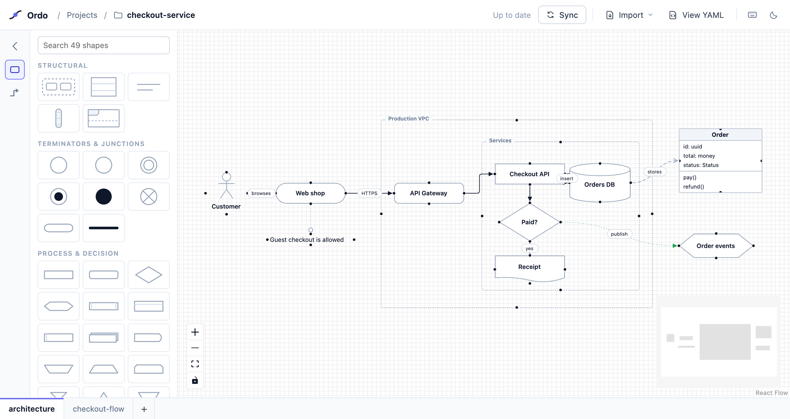
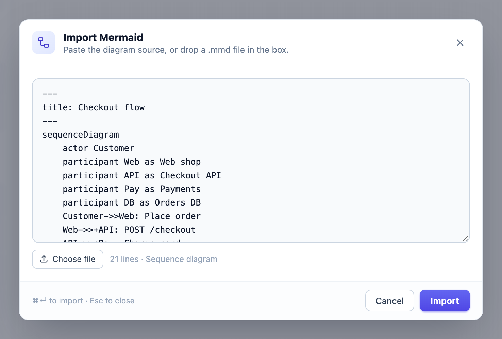
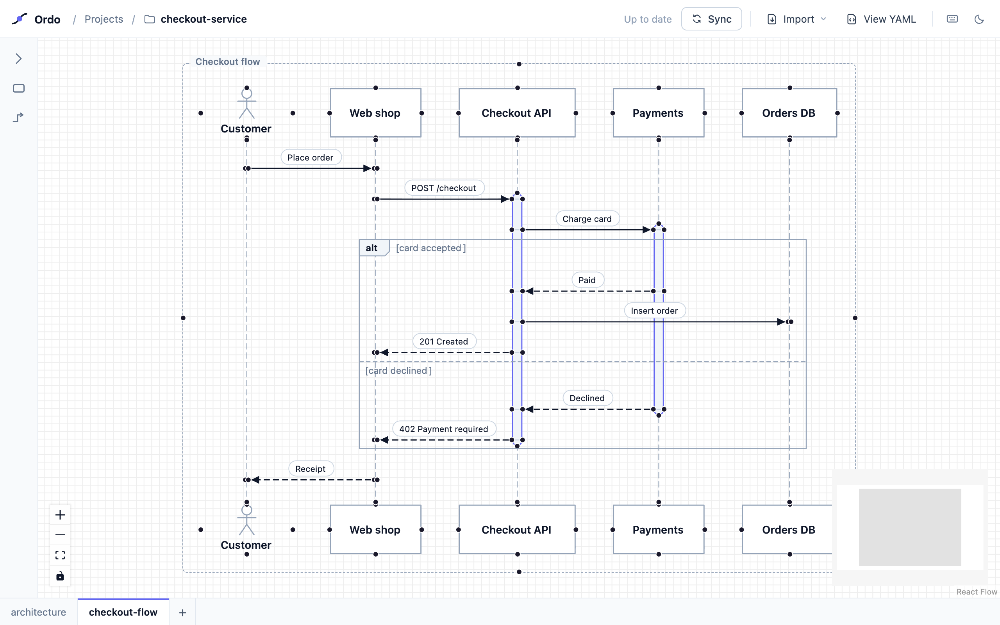

<p align="center">
  <picture>
    <source media="(prefers-color-scheme: dark)" srcset="docs/assets/ordo-logo-dark.svg">
    
  </picture>
</p>

<h3 align="center">Diagrams that live in your repo.</h3>

<p align="center">
  Draw on an infinite canvas, or paste Mermaid and get a diagram you can drag.<br>
  Every diagram is a small YAML file in <code>.ordo/</code> that you diff, review and commit like code.
</p>

<p align="center">
  <a href="#try-it-in-a-minute">Try it</a> ·
  <a href="#why-ordo">Why Ordo</a> ·
  <a href="#bring-your-agent">Agents</a> ·
  <a href="#run-it-for-real">Run it</a> ·
  <a href="#roadmap">Roadmap</a> ·
  <a href="docs/development.md">Develop</a>
</p>

<p align="center">
  <a href="LICENSE"></a>
  
  <a href="#bring-your-agent"></a>
  
</p>

<picture>
  <source media="(prefers-color-scheme: dark)" srcset="docs/assets/hero-dark.png">
  
</picture>

Architecture diagrams go stale because they live somewhere else: in a
whiteboard tool with its own login, in a PNG on the wiki, or in a Mermaid block
whose layout you can't touch.

Ordo keeps them next to the code they describe. Open a repo and draw, and each
diagram lands in `.ordo/` as a plain YAML file. Move a box, and `git diff`
shows one line. Change the file in a PR, with `git pull` or through an AI
agent, and the canvas catches up by itself. Nothing leaves your machine.

> [!NOTE]
> Ordo is early. The canvas, Mermaid import, the file format and local repo
> mode all work today. The [roadmap](#roadmap) says what's next.

## Try it in a minute

```bash
git clone https://github.com/Srinu0342/ordo-editor.git
cd ordo-editor
npm install
npm run dev
```

Open http://localhost:5173, pick any repo, and name your first diagram. Opening
a repo writes nothing: `.ordo/` is created with the first diagram you make.

You need Node.js `^20.19.0` or `>=22.12.0`. To run a production build or use
Docker, see [Run it for real](#run-it-for-real).

## Why Ordo

### It lives in your repo

Each diagram is one file, `.ordo/<name>/ordo.yaml`, and one tab at the bottom
of the canvas. The structure comes first and the layout after a `---`, so
moving a box changes one line:

```diff
   receipt: { x: 30, y: 260 }
-  queue: { x: 1080, y: 300 }
+  queue: { x: 1080, y: 380 }
   order: { x: 1080, y: 60, w: 190, h: 150 }
```

Saving keeps your comments, key order and indentation. Ordo never runs git, so
you commit `.ordo/` like any other folder and review diagrams in the same PR as
the code they describe.

### Mermaid in, a real diagram out

<table>
  <tr>
    <td width="44%">
      <picture>
        <source media="(prefers-color-scheme: dark)" srcset="docs/assets/import-dark.png">
        
      </picture>
    </td>
    <td>
      <picture>
        <source media="(prefers-color-scheme: dark)" srcset="docs/assets/sequence-dark.png">
        
      </picture>
    </td>
  </tr>
  <tr>
    <td>Paste Mermaid source, or drop in a <code>.mmd</code> or <code>.md</code> file…</td>
    <td>…and get boxes, lifelines, activation bars and frames you can move, restyle and nest.</td>
  </tr>
</table>

Flowcharts keep Mermaid's own layout, so the import looks the way Mermaid drew
it. Sequence diagrams come back with participants, lifelines, activations,
notes and loop, alt, opt and par frames. From there it's an Ordo diagram, so
you're no longer stuck with the layout engine's choices.

### Sync goes both ways

Edit on the canvas and Ordo writes the file. Change the file, whether through
`git pull`, a teammate's commit or an agent, and the canvas reloads it. Sync
runs by itself every 10 seconds, or straight away on `⌘S`. If both sides
changed, it stops and asks which to keep. It never overwrites a file it hasn't
seen.

### Every shape is data

A node doesn't render markup. It returns a flat list of primitives, with theme
tokens for colours. The canvas draws that list with React, and a headless
walker draws the same list as SVG in plain Node, with no browser. Adding a
shape means adding one row to a registry. [How Ordo works](docs/architecture.md)
explains the design.

## What you can draw

- **49 shapes in six groups:** terminators, process and decision,
  input/output, documents, storage, and annotation. Search the palette and drag
  a shape onto the canvas.
- **Five structural nodes:** a **Group** holds other nodes, a **Class** stacks
  compartments for UML classes and ER entities, **Text** is a label with no
  frame, a **Timeline tube** is an activation bar that rides an edge, and a
  **Fragment** is the loop/alt/opt/par frame of a sequence diagram.
- **Edges** in four routes (straight, orthogonal, rounded step and curved), with
  flowchart, UML and ER cardinality markers and your choice of colour, weight
  and dash.
- **The editing you'd expect:** lasso and multi-select, copy and paste at the
  pointer, undo and redo, alignment guides on a 10 px grid, drop a node into a
  group to nest it, double-click a label to edit it, and light and dark themes.

## Bring your agent

Agents are good at writing text files, and an Ordo diagram is a text file. Ask
yours to write one into `.ordo/<name>/ordo.yaml`. With the repo open in Ordo,
the new diagram shows up as a tab within about ten seconds, and later edits to
the open one load by themselves. When you edit on the canvas, the agent sees
your changes the next time it reads the file.

Ordo also serves MCP at `/mcp`, so the agent can check its work before you see
it:

| Tool            | What it does |
| --------------- | ------------ |
| `validate_ordo` | Parses a diagram and returns the same diagnostics the import dialog shows, with line and column. |
| `list_shapes`   | Lists every shape a box can take, by palette group, with the Mermaid aliases that map to them. |

To connect Claude Code:

```bash
claude mcp add --transport http ordo http://localhost:5173/mcp
```

Any other client that speaks Streamable HTTP can use the same URL. The tools
work only on file text and never touch the canvas in your browser. Good
starting points for an agent are [examples/checkout.yml](examples/checkout.yml),
which uses every node kind, and the [format reference](docs/ordo-rf-mapping.md).

## Run it for real

Ordo is a local tool. It has no login, so it only answers on this machine.

```bash
npm install
npm run build
npm start                      # http://localhost:5173
```

The project picker starts at your home folder. To open repos from somewhere
else, set the workspace root in `.env` at the top of the clone:

```bash
cp .env.sample .env      # then set ORDO_WORKSPACE=~/code in it
```

`.env.sample` lists every setting (`ORDO_WORKSPACE`, `PORT`, `HOST`). The server
reads `.env` when it starts, so restart it after a change. A variable set in
the shell wins over the file, so `ORDO_WORKSPACE=~/notes npm start` works for
a one-off.

<details>
<summary><b>With Docker</b></summary>

```bash
docker build -t ordo .
docker run --rm -p 127.0.0.1:5173:5173 \
  -v ~/code:/workspace/code \
  -v ~/Desktop/personal-projects:/workspace/personal-projects \
  ordo
```

Each `-v` mounts a folder of repos under `/workspace`, the root inside the
container. Keep the `127.0.0.1:` in `-p`: without it Docker publishes the port
on every network interface, and anyone who can reach your machine could read
and write the mounted repos. On Linux, add `--user "$(id -u):$(id -g)"` so the
files Ordo writes belong to you.

</details>

<details>
<summary><b>macOS asks about Desktop, Documents or Downloads</b></summary>

The first listing of Desktop, Documents or Downloads may ask for your terminal
to get access to them. If it is refused, the picker says it can't read that
folder. You can allow it under System Settings › Privacy & Security › Files and
Folders.

</details>

## Reference

<details>
<summary><b>Projects, tabs and Sync</b></summary>

http://localhost:5173/ opens on **Open a project**: the repos you opened lately,
and a browser over the folders under the workspace root (your home folder by
default; see [Run it for real](#run-it-for-real)). There is no canvas until a
project is open.

- A folder with no diagrams yet asks for the first one's name.
- A folder with diagrams opens the editor on its first tab.
- **Projects** in the header closes the project and goes back to the list.

The repo and the open diagram go in the URL, so a reload or a bookmark comes
back to the same place:

```
http://localhost:5173/?source=local&repo=code/payments-api&tab=checkout
```

- Each diagram is one file, `<repo>/.ordo/<name>/ordo.yaml`, and shows as a tab
  at the bottom of the canvas. `+` creates a new one; `.ordo/` is created with
  the first diagram, so opening a repo writes nothing.
- **Sync** (or `⌘S`) is two-way, and also runs on its own every 10 seconds. If
  only the canvas changed it writes the file; if only the file changed (an
  agent, `git pull`) it loads it. If both changed it asks: keep yours, take the
  file's, or download yours. The automatic one never asks: it says what needs
  a choice once and leaves it for Sync. It never overwrites a file it hasn't
  seen.
- A save keeps the file's own indentation, and a drag changes only lines after
  the `---`, so diffs stay small.
- Leaving a diagram with unsynced edits asks first.
- **Import** brings in a Mermaid diagram or an Ordo `.yaml` file; **View YAML**
  shows the canvas as its file, to copy or download.
- Ordo never runs git. Commit `.ordo/` like any other folder.

One Ordo process serves every repo under the root, and each browser tab can
have a different repo open.

</details>

<details>
<summary><b>Mermaid import</b></summary>

Paste Mermaid source, drop in a file (`.mmd`, `.mermaid`, `.md`, `.txt`), or
browse for one. Ordo reads the diagram type with Mermaid's own detector and
sends the diagram to the importer for that type:

| Diagram   | How it imports |
| --------- | -------------- |
| Flowchart | Ordo keeps Mermaid's parse and its dagre layout, so the result matches Mermaid's own render. Subgraphs become groups, and the extended `A@{ shape: … }` syntax maps onto Ordo's shapes. |
| Sequence  | Ordo uses the parse only and rebuilds the layout in its own units. It imports participants, lifelines, activations (as tubes), messages, notes, and loop/alt/opt/par/critical/break fragments. |

Ordo recognises other diagram types (class, state, ER, Gantt and so on) by
name and shows a toast saying it can't import them yet. It does not push them
through the wrong importer.

In a Markdown file, Ordo imports the first ` ```mermaid ` block. A front-matter
`title:` names the group the diagram lands in. Each import arrives as one
selected group, placed to the right of whatever is already on the canvas.

</details>

<details>
<summary><b>Keyboard shortcuts</b></summary>

Use `⌘` on macOS and `Ctrl` elsewhere. In the app, the keyboard button in the
header shows this list.

| Shortcut             | Action |
| -------------------- | ------ |
| Shift-drag           | Lasso select |
| `⌘`-click            | Add to the selection |
| `⌘A`                 | Select all |
| `⌘C` / `⌘X` / `⌘V`   | Copy / cut / paste at the pointer |
| `⌘D`                 | Duplicate |
| `⌘Z` / `⇧⌘Z`         | Undo / redo |
| `⌘S`                 | Sync |
| Delete / Backspace   | Delete the selection |
| Double-click a label | Edit it |

In the import dialog, `⌘Enter` imports and `Esc` closes.

</details>

## Roadmap

- [x] A canvas with 49 shapes, five structural nodes and styled edges
- [x] Mermaid import for flowcharts and sequence diagrams
- [x] Diagrams as files in your repo, with two-way Sync
- [x] Sync that runs by itself, so agents and `git pull` show up live
- [x] An MCP endpoint for agents
- [ ] Rename and delete diagrams from Ordo (today you do that with git or by hand)
- [ ] Hosted mode, with GitHub as the repo
- [ ] More Mermaid importers: class, state, ER and C4

Exporting to Mermaid is deliberately out of scope. Import is one way.

## Contributing

Your first PR can be one row. Every box shape is an entry in
[`src/shapes/registry.ts`](src/shapes/registry.ts), and the palette, its
search, the file format and the MCP tools all read from there:

```ts
const PROC: ShapeSet = {
  rect: {
    label: "Process",
    size: [160, 48],
    draw: (w, h) => [rect(1, 1, n(w - 2), n(h - 2)), mid(w, h)],
  },
  // …
};
```

[Developing Ordo](docs/development.md) covers setup, scripts, tests and the code
layout, and [How Ordo works](docs/architecture.md) explains the design. Please
run `npm test` and `npm run typecheck` before opening a PR. Issues and pull
requests are welcome.

## License

[MIT](LICENSE) © 2026 Subhadip Hazra
