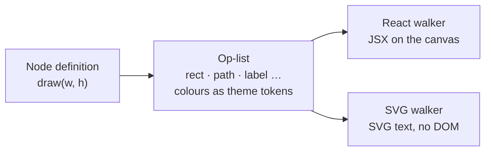

# Ordo

[](LICENSE)

A diagram editor where every shape is data. Draw flowcharts and sequence
diagrams on an infinite canvas, or paste Mermaid source and get back a diagram
you can edit.

Built on [React Flow](https://reactflow.dev), with a headless SVG renderer that
draws the same shapes outside the browser.

> **Status: early.** The canvas, the node and edge library, Mermaid import and
> the Ordo file format all work. You open a project (a folder, usually a repo);
> its diagrams live in its `.ordo/` folder, and a Sync button keeps the canvas
> and the files in step.

## Features

### Canvas

- **49 shapes in six groups:** terminators, process and decision,
  input/output, documents, storage, and annotation. Search the palette and drag
  a shape onto the canvas.
- **Five structural nodes:**
  - **Group** holds other nodes.
  - **Class** stacks compartments, for UML classes and ER entities.
  - **Text** is a label with no frame.
  - **Timeline tube** is an activation bar that rides an edge.
  - **Fragment** is the loop/alt/opt/par frame of a sequence diagram.
- **Edges** come in four routes: straight, orthogonal, rounded step and
  curved. End markers cover flowchart, UML and ER cardinality, and you can set
  stroke colour, weight and dash. All of it lives in the sidebar's Edges panel,
  which opens by itself when you select a line.

### Editing

- Lasso and multi-select. Copy, cut and paste at the pointer, or duplicate.
- Undo and redo over the last 30 changes.
- Alignment guides while you drag, on top of a 10 px grid.
- Drop nodes into a group to nest them. Drag them out to release them.
- Double-click a label to edit it. Resize any node from its handles.

### Mermaid import

Paste Mermaid source, drop in a file (`.mmd`, `.mermaid`, `.md`, `.txt`), or
browse for one. Ordo reads the diagram type with Mermaid's own detector and
sends the diagram to the importer for that type:

| Diagram   | How it imports |
| --------- | -------------- |
| Flowchart | Ordo keeps Mermaid's parse and its dagre layout, so the result matches Mermaid's own render. Subgraphs become groups, and the extended `A@{ shape: … }` syntax maps onto Ordo's shapes. |
| Sequence  | Ordo uses the parse only and rebuilds the layout in its own units. It imports participants, lifelines, activations (as tubes), messages, notes, and loop/alt/opt/par/critical/break fragments. |

Ordo recognises other diagram types (class, state, ER, Gantt and so on) by
name and shows a toast saying it can't import them yet. It does not push them
through the wrong importer.

In a Markdown file, Ordo imports the first ` ```mermaid ` block. A front-matter
`title:` names the group the diagram lands in. Each import arrives as one
selected group, placed to the right of whatever is already on the canvas.

## Projects

http://localhost:5173/ opens on **Open a project**: the repos you opened lately,
and a browser over the folders under the workspace root (your home folder by
default; see [Running](#running)). There is no canvas until a project is open.

- A folder with no diagrams yet asks for the first one's name.
- A folder with diagrams opens the editor on its first tab.
- **Projects** in the header closes the project and goes back to the list.

The repo and the open diagram go in the URL, so a reload or a bookmark comes
back to the same place:

```
http://localhost:5173/?source=local&repo=code/payments-api&tab=checkout
```

- Each diagram is one file, `<repo>/.ordo/<name>/ordo.yaml`, and shows as a tab
  at the bottom of the canvas. `+` creates a new one; `.ordo/` is created with
  the first diagram, so opening a repo writes nothing.
- **Sync** (or `⌘S`) is manual and two-way. If only the canvas changed it writes
  the file; if only the file changed (an agent, `git pull`) it loads it. If both
  changed it asks: keep yours, take the file's, or download yours. It never
  overwrites a file it hasn't seen.
- A save keeps the file's own indentation, and a drag changes only lines after
  the `---`, so diffs stay small.
- Leaving a diagram with unsynced edits asks first.
- **Import** brings in a Mermaid diagram or an Ordo `.yaml` file; **View YAML**
  shows the canvas as its file, to copy or download.
- Ordo never runs git. Commit `.ordo/` like any other folder.

One Ordo process serves every repo under the root, and each browser tab can
have a different repo open.

## Getting started

You need Node.js `^20.19.0` or `>=22.12.0`, the versions Vite supports.

```bash
git clone https://github.com/Srinu0342/ordo-editor.git
cd ordo-editor
npm install
npm run dev
```

Then open http://localhost:5173.

### Scripts

| Command             | What it does |
| ------------------- | ------------ |
| `npm run dev`       | Start the server with Vite inside it, with hot reload |
| `npm run build`     | Typecheck, then build a production bundle into `dist/` |
| `npm start`         | Serve the production bundle and the API |
| `npm run preview`   | Serve the production bundle locally |
| `npm test`          | Run the test suite with Node's built-in test runner (through `tsx`) |
| `npm run typecheck` | Run `tsc` without emitting files |

## Running

Ordo is a local tool. It has no login, so it only answers on this machine.

### From a clone

```bash
npm install
npm run build
npm start                      # http://localhost:5173
```

The repo picker starts at your home folder. To open repos from somewhere else,
set the workspace root in `.env` at the top of the clone:

```bash
cp .env.sample .env      # then set ORDO_WORKSPACE=~/code in it
```

`.env.sample` lists every setting (`ORDO_WORKSPACE`, `PORT`, `HOST`). The server
reads `.env` when it starts, so restart it after a change. A variable set in
the shell wins over the file, so `ORDO_WORKSPACE=~/notes npm start` works for
a one-off.

On macOS the first listing of Desktop, Documents or Downloads may ask for your
terminal to get access to them. If it is refused, the picker says it can't read
that folder. You can allow it under System Settings › Privacy & Security ›
Files and Folders.

### With Docker

```bash
docker build -t ordo .
docker run --rm -p 127.0.0.1:5173:5173 \
  -v ~/code:/workspace/code \
  -v ~/Desktop/personal-projects:/workspace/personal-projects \
  ordo
```

Each `-v` mounts a folder of repos under `/workspace`, the root inside the
container. Keep the `127.0.0.1:` in `-p`: without it Docker publishes the port
on every network interface, and anyone who can reach your machine could read
and write the mounted repos. On Linux, add `--user "$(id -u):$(id -g)"` so the
files Ordo writes belong to you.

## Keyboard shortcuts

Use `⌘` on macOS and `Ctrl` elsewhere. In the app, hover over the selection
count in the toolbar to see this list.

| Shortcut             | Action |
| -------------------- | ------ |
| Shift-drag           | Lasso select |
| `⌘`-click            | Add to the selection |
| `⌘A`                 | Select all |
| `⌘C` / `⌘X` / `⌘V`   | Copy / cut / paste at the pointer |
| `⌘D`                 | Duplicate |
| `⌘Z` / `⇧⌘Z`         | Undo / redo |
| `⌘S`                 | Sync (local repo mode) |
| Delete / Backspace   | Delete the selection |
| Double-click a label | Edit it |

In the import dialog, `⌘Enter` imports and `Esc` closes.

## How it works

### Nodes draw themselves as data

A node doesn't return markup. It returns a flat **op-list**: rects, ellipses,
paths, lines, labels and groups, in node-local coordinates. Colours in the list
are theme tokens such as `node.fill` and `edge.stroke`, not literal values. Two
walkers read the same list:



- [`render/reactWalker.tsx`](src/render/reactWalker.tsx) turns the list into
  JSX for the canvas. The node component then adds handles, the resizer and the
  selection ring, which are never part of the op-list.
- [`render/svgWalker.ts`](src/render/svgWalker.ts) turns the list into SVG text
  in plain Node, with no DOM, jsdom or React. That means a diagram can be
  rendered on a server, in CI or in a git hook. The palette thumbnails are drawn
  through this walker, so if it ever drifts from the canvas, the palette shows
  it.

### Structure is a type; outline is a value

A stadium is just a rectangle with rounder corners, so it isn't its own node
type. All 49 shapes are values of a single Box node's `shape` property, and
each one is a row in [`src/shapes/registry.ts`](src/shapes/registry.ts). A UML
class has compartments and its own internal layout, so it gets its own type.

To add a shape, add a row. The palette and its search read the registry, so
the new shape shows up there automatically:

```ts
// src/shapes/registry.ts
const PROC: ShapeSet = {
  rect: {
    label: "Process",
    size: [160, 48],
    draw: (w, h) => [rect(1, 1, n(w - 2), n(h - 2)), mid(w, h)],
  },
  // …
};
```

### Undo stores diffs

Each undo step stores only the paths that changed in each node and edge, not a
copy of the whole graph. Because of that, undoing a change leaves the
selection, measured sizes and everything else the canvas owns as they are. The
diffing logic in [`src/history.ts`](src/history.ts) is pure and has no React
dependency.

## Project layout

```
server/
├── index.ts             One process: the editor, /api and /mcp
├── api.ts               Local repo API: host and origin checks, routes
├── workspace.ts         Workspace root and path rules
└── diagrams.ts          .ordo/<name>/ordo.yaml: reads, hash-checked atomic writes
src/
├── App.tsx              Canvas: drag and drop, grouping, clipboard, shortcuts
├── ops.ts               Op-list types and builders
├── theme.ts             Theme tokens
├── shapes/registry.ts   Every Box shape, grouped for the palette
├── nodes/               Box, Group, Class, Text, Tube, Fragment
├── edges/               Edge component, routers, markers, edge attachment
├── render/              React and headless SVG walkers
├── mermaid/             Type detection, flowchart and sequence importers
├── components/          Toolbar, palette, dialogs, repo picker, tab bar
├── ordo/                The Ordo file format: read, validate, write
├── local/               Local repo mode: URL, API client, sync decision
├── history.ts           Undo/redo as diffs (pure)
└── useHistory.ts        Decides where each undo step starts and ends
```

Tests sit in `__tests__` folders next to the code they cover. The Mermaid tests
run the real Mermaid parser under jsdom.

## Roadmap

Local repo mode's design and build plan is in
[`OrdoInteraction.md`](OrdoInteraction.md). Next:

- **Renaming and deleting tabs** in Ordo. Today you do that with git or by hand.
- **Hosted mode**, with GitHub as the repo.
- **More Mermaid importers:** class, state, ER and C4.

Exporting to Mermaid is deliberately out of scope. Import is one way.

## Contributing

Issues and pull requests are welcome. Please run `npm test` and
`npm run typecheck` before opening a PR.

## License

[MIT](LICENSE) © 2026 Subhadip Hazra
