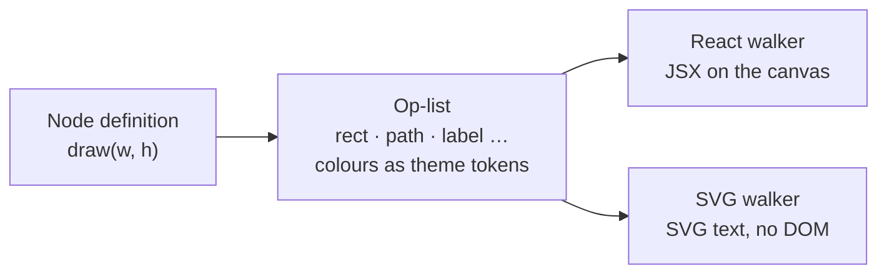

# Ordo

[](LICENSE)

A diagram editor where every shape is data. Draw flowcharts and sequence
diagrams on an infinite canvas, or paste Mermaid source and get back a diagram
you can edit.

Built on [React Flow](https://reactflow.dev), with a headless SVG renderer that
draws the same shapes outside the browser.

> **Status: early.** The canvas, the node and edge library, and Mermaid import
> all work. Saving does not exist yet: the `.ordo` file format is still being
> designed, so reloading the page gives you a blank canvas.

## Features

### Canvas

- **49 shapes in six groups:** terminators, process and decision,
  input/output, documents, storage, and annotation. Search the palette and drag
  a shape onto the canvas.
- **Five structural nodes:**
  - **Group** holds other nodes.
  - **Class** stacks compartments, for UML classes and ER entities.
  - **Text** is a label with no frame.
  - **Timeline tube** is an activation bar that rides an edge.
  - **Fragment** is the loop/alt/opt/par frame of a sequence diagram.
- **Edges** come in four routes: straight, orthogonal, rounded step and
  curved. End markers cover flowchart, UML and ER cardinality, and you can set
  stroke colour, weight and dash.

### Editing

- Lasso and multi-select. Copy, cut and paste at the pointer, or duplicate.
- Undo and redo over the last 30 changes.
- Alignment guides while you drag, on top of a 10 px grid.
- Drop nodes into a group to nest them. Drag them out to release them.
- Double-click a label to edit it. Resize any node from its handles.

### Mermaid import

Paste Mermaid source, drop in a file (`.mmd`, `.mermaid`, `.md`, `.txt`), or
browse for one. Ordo reads the diagram type with Mermaid's own detector and
sends the diagram to the importer for that type:

| Diagram   | How it imports |
| --------- | -------------- |
| Flowchart | Ordo keeps Mermaid's parse and its dagre layout, so the result matches Mermaid's own render. Subgraphs become groups, and the extended `A@{ shape: … }` syntax maps onto Ordo's shapes. |
| Sequence  | Ordo uses the parse only and rebuilds the layout in its own units. It imports participants, lifelines, activations (as tubes), messages, notes, and loop/alt/opt/par/critical/break fragments. |

Ordo recognises other diagram types (class, state, ER, Gantt and so on) by
name and shows a toast saying it can't import them yet. It does not push them
through the wrong importer.

In a Markdown file, Ordo imports the first ` ```mermaid ` block. A front-matter
`title:` names the group the diagram lands in. Each import arrives as one
selected group, placed to the right of whatever is already on the canvas.

## Getting started

You need Node.js `^20.19.0` or `>=22.12.0`, the versions Vite supports.

```bash
git clone https://github.com/Srinu0342/ordo-editor.git
cd ordo-editor
npm install
npm run dev
```

Then open the URL Vite prints (http://localhost:5173 by default).

### Scripts

| Command             | What it does |
| ------------------- | ------------ |
| `npm run dev`       | Start the Vite dev server with hot reload |
| `npm run build`     | Typecheck, then build a production bundle into `dist/` |
| `npm run preview`   | Serve the production bundle locally |
| `npm test`          | Run the test suite with Node's built-in test runner (through `tsx`) |
| `npm run typecheck` | Run `tsc` without emitting files |

## Keyboard shortcuts

Use `⌘` on macOS and `Ctrl` elsewhere. In the app, hover over the selection
count in the toolbar to see this list.

| Shortcut             | Action |
| -------------------- | ------ |
| Shift-drag           | Lasso select |
| `⌘`-click            | Add to the selection |
| `⌘A`                 | Select all |
| `⌘C` / `⌘X` / `⌘V`   | Copy / cut / paste at the pointer |
| `⌘D`                 | Duplicate |
| `⌘Z` / `⇧⌘Z`         | Undo / redo |
| Delete / Backspace   | Delete the selection |
| Double-click a label | Edit it |

In the import dialog, `⌘Enter` imports and `Esc` closes.

## How it works

### Nodes draw themselves as data

A node doesn't return markup. It returns a flat **op-list**: rects, ellipses,
paths, lines, labels and groups, in node-local coordinates. Colours in the list
are theme tokens such as `node.fill` and `edge.stroke`, not literal values. Two
walkers read the same list:



- [`render/reactWalker.tsx`](src/render/reactWalker.tsx) turns the list into
  JSX for the canvas. The node component then adds handles, the resizer and the
  selection ring, which are never part of the op-list.
- [`render/svgWalker.ts`](src/render/svgWalker.ts) turns the list into SVG text
  in plain Node, with no DOM, jsdom or React. That means a diagram can be
  rendered on a server, in CI or in a git hook. The palette thumbnails are drawn
  through this walker, so if it ever drifts from the canvas, the palette shows
  it.

### Structure is a type; outline is a value

A stadium is just a rectangle with rounder corners, so it isn't its own node
type. All 49 shapes are values of a single Box node's `shape` property, and
each one is a row in [`src/shapes/registry.ts`](src/shapes/registry.ts). A UML
class has compartments and its own internal layout, so it gets its own type.

To add a shape, add a row. The palette and its search read the registry, so
the new shape shows up there automatically:

```ts
// src/shapes/registry.ts
const PROC: ShapeSet = {
  rect: {
    label: "Process",
    size: [160, 48],
    draw: (w, h) => [rect(1, 1, n(w - 2), n(h - 2)), mid(w, h)],
  },
  // …
};
```

### Undo stores diffs

Each undo step stores only the paths that changed in each node and edge, not a
copy of the whole graph. Because of that, undoing a change leaves the
selection, measured sizes and everything else the canvas owns as they are. The
diffing logic in [`src/history.ts`](src/history.ts) is pure and has no React
dependency.

## Project layout

```
src/
├── App.tsx              Canvas: drag and drop, grouping, clipboard, shortcuts
├── ops.ts               Op-list types and builders
├── theme.ts             Theme tokens
├── shapes/registry.ts   Every Box shape, grouped for the palette
├── nodes/               Box, Group, Class, Text, Tube, Fragment
├── edges/               Edge component, routers, markers, edge attachment
├── render/              React and headless SVG walkers
├── mermaid/             Type detection, flowchart and sequence importers
├── components/          Toolbar, palette sidebar, import dialog, guides
├── history.ts           Undo/redo as diffs (pure)
└── useHistory.ts        Decides where each undo step starts and ends
```

Tests sit in `__tests__` folders next to the code they cover. The Mermaid tests
run the real Mermaid parser under jsdom.

## Roadmap

The planning notes are in [`ordo-workstreams.md`](ordo-workstreams.md). Next:

- **The `.ordo` file format.** Diagrams as text, with layout kept apart from
  structure so that dragging a node produces a small diff. Saving and loading
  depend on this.
- **The engine.** Parse and serialise `.ordo` files, with a byte-for-byte round
  trip.
- **More Mermaid importers:** class, state, ER and C4.

Exporting to Mermaid is deliberately out of scope. Import is one way.

## Contributing

Issues and pull requests are welcome. Please run `npm test` and
`npm run typecheck` before opening a PR.

## License

[MIT](LICENSE) © 2026 Subhadip Hazra
