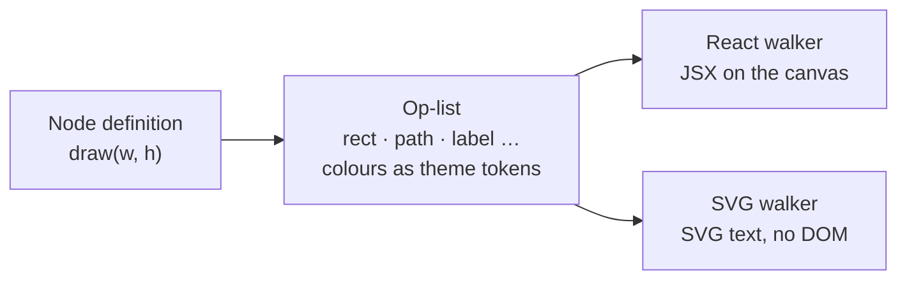

# How Ordo works

The ideas the code is built on. For running it, testing it and finding your way
around the tree, see [development.md](development.md). For the file format,
see [ordo-rf-mapping.md](ordo-rf-mapping.md).

## One process

[`server/index.ts`](../server/index.ts) serves everything on one port:

- `/api` is the local repo API: list folders, read and write
  `.ordo/<name>/ordo.yaml`.
- `/mcp` is an MCP endpoint over Streamable HTTP.
- Every other path is the editor.

In dev, Vite runs inside this server as middleware, so the editor keeps hot
reload and its HMR websocket uses the same port. In production the server
serves the bundle `vite build` wrote to `dist/`.

There is no login, so the server only answers this machine. It binds to
loopback. A Host check stops DNS rebinding, and an exact-Origin check stops
another site, or another dev server on another localhost port, from driving the
API from your browser. The server keeps no "current repo": every call names its
repo and tab, so two browser tabs on two repos can't move each other.

## Nodes draw themselves as data

A node doesn't return markup. It returns a flat **op-list**: rects, ellipses,
paths, lines, labels and groups, in node-local coordinates. Colours in the list
are theme tokens such as `node.fill` and `edge.stroke`, not literal values. Two
walkers read the same list:



- [`render/reactWalker.tsx`](../src/render/reactWalker.tsx) turns the list into
  JSX for the canvas. The node component then adds handles, the resizer and the
  selection ring, which are never part of the op-list.
- [`render/svgWalker.ts`](../src/render/svgWalker.ts) turns the list into SVG
  text in plain Node, with no DOM, jsdom or React. That means a diagram can be
  rendered on a server, in CI or in a git hook. The palette thumbnails are drawn
  through this walker, so if it ever drifts from the canvas, the palette shows
  it.

## Structure is a type; outline is a value

A stadium is just a rectangle with rounder corners, so it isn't its own node
type. All 49 shapes are values of a single Box node's `shape` property, and
each one is a row in [`src/shapes/registry.ts`](../src/shapes/registry.ts). A
UML class has compartments and its own internal layout, so it gets its own
type.

To add a shape, add a row. The palette and its search read the registry, so the
new shape shows up there automatically:

```ts
// src/shapes/registry.ts
const PROC: ShapeSet = {
  rect: {
    label: "Process",
    size: [160, 48],
    draw: (w, h) => [rect(1, 1, n(w - 2), n(h - 2)), mid(w, h)],
  },
  // …
};
```

## The file keeps its shape

An Ordo file is two YAML documents: the structure (nodes, nesting, edges,
labels, shapes), then a `---` line, then the layout (positions and sizes). A
drag only changes lines after the `---`, and a rename only lines before it.

Exports patch the YAML documents from the last import rather than generating
new ones. That is why comments, key order, indentation and blank lines survive
canvas edits, and why a drag shows up in `git diff` as one changed line.

Every node type and every field the editor sets has a place in the format, so
any canvas exports, imports back unchanged, and exports again byte-identically.
The JSON Schemas in `src/ordo/schema/` are closed, so a misspelt field is an
error, not something silently dropped.

## Sync compares against a base

For the diagram on the canvas, local mode keeps a **base**: the file's ETag as
last loaded or written, and the canvas's own export at that moment. Sync checks
both sides against it, and [`src/local/sync.ts`](../src/local/sync.ts) decides
what happens:

| Canvas changed | File changed | Sync |
| -------------- | ------------ | ---- |
| yes | no  | writes the file |
| no  | yes | loads the file |
| yes | yes | asks: keep yours, take the file's, or download yours |

Writes are conditional on the ETag, so Ordo never overwrites a file it hasn't
seen. Auto-sync runs the same check every 10 seconds, but only does what needs
no one. When a choice is needed, it says so once and leaves the choice for
Sync.

## Undo stores diffs

Each undo step stores only the paths that changed in each node and edge, not a
copy of the whole graph. Because of that, undoing a change leaves the
selection, measured sizes and everything else the canvas owns as they are. The
diffing logic in [`src/history.ts`](../src/history.ts) is pure and has no React
dependency.
